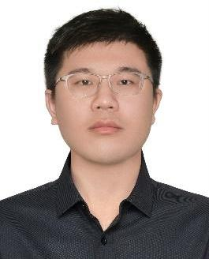

# 夏苏安

> 计算机视觉 / 4D Gaussian Splatting / VR 直播与沉浸式渲染

## 联系方式

- 手机 / 微信：18018591626
- Email：956974516@qq.com
- GitHub：<https://github.com/Akua1919>
- 期望职位：CV 工程师
- 期望城市：江浙沪、深圳
- 期望薪资：面谈

## 个人信息

- 男 / 1999
- 上海科技大学，计算机科学与技术，本科 + 硕士研究生
- 工作年限：1 年
- 研究方向：计算机视觉、AI、计算摄影学

## 教育经历

### 上海科技大学 | 计算机科学与技术

2017.09 - 2025.07

- 学历：本科 + 硕士研究生
- 导师组：虞晶怡
- 研究方向：计算机视觉、AI、计算摄影学
- 关注主题：非视域成像、AIGC、3D/4D 重建、神经渲染

## 学术相关项目

### 结合 AIGC 的非视域成像

- 围绕非视域成像任务，探索 AIGC 与计算摄影方法在隐蔽场景重建中的结合方式。
- 参与问题定义、方法调研与实验设计，关注图像/几何先验对重建质量的影响。
- 后续可继续补充数据集、模型结构、对比方法、实验指标，以及论文或报告链接。

## 工作经历

### 宁波万有引力电子科技有限公司 | CV / 3D 重建 / VR 方向

2025.07 - 至今

#### 4DGS 重建项目

- 从零搭建动态 3D/4D 重建系统，重点评估多相机同步问题，最终采用 Genlock 方案实现帧级同步。
- 基于 Spacetime、FreeTimeGS 等方向进行方法开发，支持 4K 级别动态场景重建。
- 引入前馈式高斯初始化方案，加快训练收敛过程，提升重建迭代效率。
- 实现多卡训练版本，支持更大规模数据与更高分辨率实验。
- 在 Unity 中实现并优化高斯渲染代码，结合 OpenXR 支持在头显中观看 4DGS 模型。

#### VR 直播项目

- 从零搭建 VR 直播链路，覆盖相机选型、服务器、路由器、终端设备与网络布线，实现约 500 ms 低延时、7680 x 3840 高分辨率直播。
- 部署流媒体服务器框架，并通过多轮测试比较不同传输协议，最终采用 WebRTC 作为低延时直播协议。
- 使用 Flutter 开发 2D 播放器，验证 WebRTC 在实际播放端的低延时与画质表现。
- 使用 Unity 开发沉浸式 3D 播放器，实现头显内实时观看 VR 直播内容。

## 论文与成果

- 待补充论文、专利、项目报告、技术文章或 Demo 链接。

## 技能清单

- 编程与实验：Python、PyTorch、MATLAB、C++
- 视觉与重建：Computer Vision、3D/4D Gaussian Splatting、Neural Rendering、Non-line-of-sight Imaging、AIGC
- 图形与 XR：Unity、OpenXR、实时渲染、头显端内容展示
- 直播与工程：WebRTC、Flutter、流媒体服务器、多机同步、Genlock、多卡训练
- 开发工具：Git、Codex、Claude Code；能使用 AI 辅助开发工具提升代码实现、调试、重构与文档整理效率
